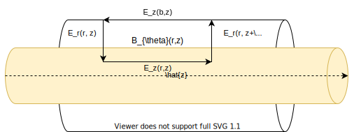
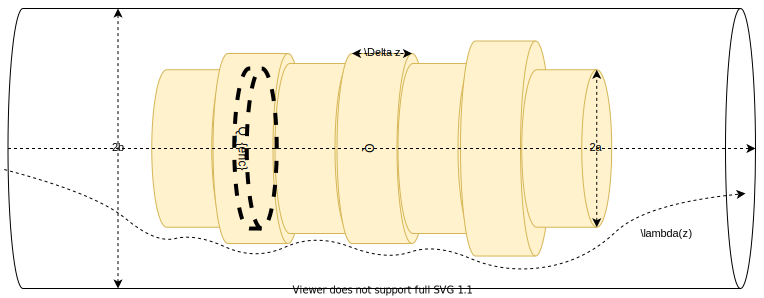
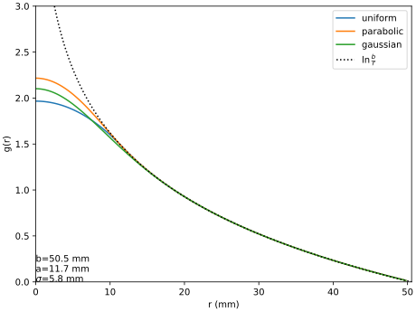

## Longitudinal Fields in a Conducting Cylinder

Consider a uniform round beam:

From ampere's law:

$$\nabla \times \vec{E} = -\frac{\partial B}{\partial t} \to \oint \vec{E}\cdot d\vec{l} = -\frac{\partial}{\partial t}\iint_S\vec{B}\cdot d\vec{A}$$

and by defining the following integration path/surface through a round charge distribution:

$$\begin{aligned}
\oint \vec{E}\cdot d\vec{l} = E_z(r,z)\Delta z + \int_r^bE_r(r', z+\Delta z)dr'-E_z(b, z)\Delta z -\int_r^bE_r(r', z)dr'
\end{aligned}$$

and:

$$\begin{aligned}
-\frac{\partial}{\partial t}\iint_S\vec{B}\cdot d\vec{A} = -\Delta z \frac{\partial}{\partial t}\int_r^bB_{\theta}(r', z)
\end{aligned}$$
Using:

$$E_r(r', z+\Delta z)-E_r(r', z) = \frac{\partial E_r(r', z)}{\partial z}\Delta z$$

Since $dz = -vdt$:

$$\begin{aligned}
E_z(r,z)-E_z(b,z)&= -\int_r^b\left[\frac{\partial E_r(r', z)}{\partial z}+\frac{\partial B_{\theta}(r', z)}{\partial t}\right]dr'\cr
&=-\frac{\partial}{\partial z}\int_r^b[E_r(r',z)-vB_{\theta}(r',z)]dr'\cr
&=-\frac{\partial}{\partial z}\int_r^b[E_r(r',z)-\beta^2E_r(r',z)]dr'
\end{aligned}$$

Therefore:

$$E_z(r,z) = E_z(b,z)-(1-\beta^2)\frac{\partial}{\partial z}\int_r^bE_r(r',z)dr'$$

The longitudinal self fields  for a beam in a conductive pipe of radius __b__ are:

$$\boxed{E_z(r, z) = -\frac{1}{\gamma^2}\frac{\partial}{\partial z}\int_r^bE_r(r', z)dr'}$$

## Radial Fields in Cylindrical Bunches

Considering a cylindrical bunch defined by it's linear charge density $\lambda(z)$, a gaussian element of length $\Delta z$ located at $z$ is defined by:

$$Q = \lambda(z) \Delta z$$

We can define $f(r)$, the proportion of charge enclosed in a cylindrical area of radius $r$ can given by the radial charge density $\rho(r)$:

$$f(r) =  \frac{\int_0^r \rho(r') r' dr'}{\int_0^\infty \rho(r') r' dr'} = \frac{Q_{enc}}{Q}$$

Therefore:

$$Q_{enc} = f(r) Q = f(r)\lambda(z) \Delta z$$

From an gaussian cylinder of length $\Delta z$ and radius $r$, we deduce from:

$$\nabla \cdot \vec{E} = \frac{\rho}{\epsilon_0} \rightarrow \int_S \vec{E}\cdot d\vec{A} = \frac{Q_{enc}}{\epsilon_0}$$

That:

$$\vec{E_r}(r) \cdot 2\pi r \Delta z = \frac{f(r) \lambda(z)\Delta z}{\epsilon_0}$$

The longitudinal self fields for a __round beam__ in a conductive pipe of radius __b__ is given by:

$$E_z(r, z) = -\frac{1}{\gamma^2}\frac{\partial}{\partial z}\int_r^bE_r(r', z)dr'$$

The radial fields for a slowly varying __coasting beam__ are:

$$E_r(r, z) = \frac{\lambda(z)}{2\pi\epsilon_0}\frac{f(r)}{r}$$

Accordingly our longitudinal fields are defined by:

$$\boxed{E_z = -\frac{\bar{g}}{2\pi\epsilon_0\gamma^2}\frac{\partial \lambda}{\partial z}}$$

Where the __geometry factor__ $\bar{g}$ is defined by:

$$\bar{g} = \int_r^b\frac{f(r')}{r'}dr' \qquad f(r) =  \frac{\int_0^r \rho(r') r' dr'}{\int_0^\infty \rho(r') r' dr'} = \frac{Q_{enc}}{Q}$$

# Round Beam Profiles

## Uniform Round Beam

A uniform charge distribution in a cylindrical beam is defined by constant surface charge density:

$$\rho(r) = \sigma = \frac{Q}{\pi a^2}$$

For $r < a$:

$$f(r) = \frac{r^2}{a^2}$$

$$E_r(r, z) = \frac{\lambda(z)}{2\pi\epsilon_0}\frac{r}{a^2}$$

For $r > a$:

$$f(r) = 1$$

$$E_r(r, z)=\frac{\lambda(z)}{2\pi\epsilon_0}\frac{1}{r}$$

Our geometric factors are therefore:

$$\begin{aligned}
g(r<a) &= \int_r^a \frac{r'}{a^2}dr'+\int_a^b\frac{1}{r'}dr'\cr
&= \frac{1}{2}\frac{r'^2}{a^2}\Big|_r^a + \ln(r')\Big|^b_a \cr
&=  \frac{1}{2} - \frac{1}{2}\frac{r^2}{a^2} + \ln\left(\frac{b}{a}\right)\cr
\end{aligned}$$

and:

$$g(r>a) = \int_r^b\frac{1}{r'}dr' = \ln\left(\frac{b}{r}\right)$$

## Parabolic Round Beam

  
We can define a radial parabolic charge distribution of width $a$ with the following:

$$\rho(r) = \frac{2Q}{\pi a^2}\left(1-\frac{r^2}{a^2}\right)$$

Accordingly:

$$Q = \int_0^a \rho(r) r dr d\theta$$

We can then define our relative enclosed charge $f(r)$.

For r < a:

$$\begin{aligned}
f(r) &= \frac{2\pi}{Q}\int_0^r\rho(r')r'dr' \cr
&= \frac{4}{a^2}\int_0^rr'(1-\frac{r'^2}{a^2})dr'\cr
&= \frac{4}{a^2}\left(\frac{r'^2}{2}\Big|_0^r -\frac{r'^4}{4a^2}\Big|_0^r\right)\cr
&= \frac{4}{a^2}\left(\frac{r^2}{2}-\frac{r^4}{4a^2}\right)\cr
&= 2\frac{r^2}{a^2}-\frac{r^4}{a^4}
\end{aligned}$$

For r > a:

$$f(r) = 1$$

Therefore our geometric factor is defined by:

$$\begin{aligned}
g(r<a) &= \int_r^a \frac{1}{r'}\left(2\frac{r'^2}{a^2}-\frac{r'^4}{a^4}\right)dr'+ \int_a^b\frac{dr'}{r'}\cr
&=\frac{r'^2}{a^2}\Big|_r^a-\frac{r'^4}{4a^4}\Big|_r^a + \ln\left(r'\right)\Big|_a^b\cr
&= \ln\left(\frac{b}{a}\right) + \frac{a^2-r^2}{a^2} - \frac{a^4-r^4}{4a^4}
\end{aligned}$$

and:

$$g(r>a) = \int_r^b\frac{1}{r'}dr' = \ln\left(\frac{b}{r}\right)$$

## Gaussian Beam:

Given a radial charge distribution is defined by:

$$\rho(r) = \frac{Q}{\sigma_r^2(\sqrt{2\pi})^2}\exp\left(-\frac{r^2}{2\sigma_r^2}\right)$$

Therefore our form factor $f(r)$:

$$f(r) = \frac{\int_0^r\rho(r')r'dr}{\int_0^\infty \rho(r')r'dr} = \frac{1}{2\pi}\int_0^r r'\exp\left(-\frac{r'^2}{2\sigma_r^2}\right)dr' = 1-\exp\left(-\frac{r^2}{2\sigma_r^2}\right)$$

Therefore:

$$\begin{aligned}
g(r) &= \int_r^b\frac{1}{r'}\left(1-\exp\left(-\frac{r'^2}{2\sigma_r^2}\right)\right)dr'\cr
&=\int_r^b\frac{dr'}{r'} -\int_r^b\frac{1}{r'}\exp\left(-\frac{r^2}{2\sigma_r^2}\right)dr'\cr
&= \ln(r')\Big|_r^b -\frac{1}{2}\text{Ei}\left(-\frac{r'^2}{2\sigma_r^2}\right)\Big|_r^b\cr
&= \ln\left(\frac{b}{r}\right)-\frac{1}{2}\left(\text{Ei}(-\frac{b^2}{2\sigma_r^2})-\text{Ei}(-\frac{r^2}{2\sigma_r^2})\right)
\end{aligned}$$

Where the exponential integral $\text{Ei}$ is defined by:

$$\text{Ei}(x) = \int_{-\infty}^x \frac{e^t}{t}dt$$

Our maximum value occurs at:

$$g(0) = \frac{1}{2}\left(\ln\left(\frac{b^2}{2\sigma_r^2}\right)+\Gamma(0, \frac{b^2}{2\sigma_r^2}+\gamma\right)$$

Where:

$$\Gamma(a, x) = \frac{1}{\Gamma(a)}\int_0^xt^{a-1}e^{-t}dt$$

and:

$$\gamma = \lim_{n\to\infty}\left(-\ln n +\sum_{k=1}^n\frac{1}{k}\right) \approx 0.57721$$

  
$$\boxed{g(r) = \ln\left(\frac{b}{r}\right)-\frac{1}{2}\left(\text{Ei}(-\frac{b^2}{2\sigma_r^2})-\text{Ei}(-\frac{r^2}{2\sigma_r^2})\right)}$$
  
# Summary

In summary we have the following geometric factors:

| profile   | $\rho(r)$| $g(r <a)$| $g(r > a)$ | $g(r=0)$ |
| :-: | :-:| :-: | :-: | :-: |
| uniform   | $\frac{1}{\pi a^2}$ | $\ln\left(\frac{b}{a}\right) + \frac{1}{2} - \frac{1}{2}\frac{r^2}{a^2}$ | $\ln\left(\frac{b}{r}\right)$ | $\ln\left(\frac{b}{a}\right) + \frac{1}{2}$|
| parabolic | $\frac{2}{\pi a^2}\left(1-\frac{r^2}{a^2}\right)$ | $\ln\left(\frac{b}{a}\right) + \frac{a^2-r^2}{a^2} - \frac{a^4-r^4}{4a^4}$ | $\ln\left(\frac{b}{r}\right)$ | $\ln\left(\frac{b}{a}\right) + \frac{3}{4}$ |
| gaussian  | $\frac{\exp\left(-\frac{r^2}{2\sigma_r^2}\right)}{2\pi\sigma_r^2}$ | $\ln\left(\frac{b}{r}\right)-\frac{1}{2}\left[\text{Ei}\left(\frac{-b^2}{2\sigma_r^2}\right)-\text{Ei}\left(\frac{-r^2}{2\sigma_r^2}\right)\right]$ | --- | $\frac{1}{2}\left(\ln\left(\frac{b^2}{2\sigma_r^2}\right)+\Gamma(0, \frac{b^2}{2\sigma_r^2}+\gamma\right)$ |

We can visualize these distributions and geometric factors below:

We observe that the resulting geometric factors used to represent the self fields of particles in or outside equivalently sized uniform, parabolic or gaussian are mostly equivalent.
