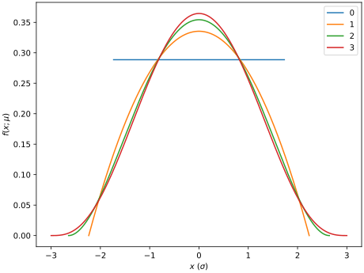
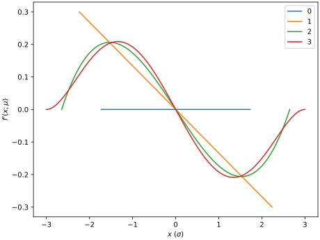

A normal distribution is commonly defined by:

$$f(x) = \frac{1}{\sqrt{2\pi\sigma^2}}\exp\left[-\frac{1}{2}\left(\frac{x-\mu}{\sigma}\right)^2\right]$$

Since:

$$\exp x = \sum_{k=0}^\infty \frac{x^k}{k!} = 1 + x + \frac{x^2}{2} + \frac{x^3}{6} + \frac{x^4}{24} + \ldots$$

one can define a uniform distribution $(k=0)$, a parabolic distribution $(k=1)$, gaussian $(k=\infty)$, and everything inbetween.

Therefore:

$$f(x;m) = \frac{1}{\sqrt{2\pi\sigma^2}}\sum_{k=0}^m\frac{1}{k!}\left[-\frac{1}{2}\left(\frac{x-\mu}{\sigma}\right)^2\right]^k$$

$$\text{Var}(X) = \int_\mathcal{R}(x-\mu)^2f(x)dx$$

The generalized noramalized distribution can be given by:

$$f(x: m) = \frac{2\Gamma(3/2+m)}{L\sqrt{\pi}\Gamma(1+m)}\left[1-4\left(\frac{x}{L}\right)^2\right]^m$$

The derivative is therefore given by:

$$-\frac{16m x \Gamma(m+3/2)}{\sqrt{\pi}L^3\Gamma(m+1)} \left[1-4\left(\frac{x-\mu}{L}\right)^2\right]^{m-1}$$

where the variance is given by:
$$\sigma^2 = \frac{L^2}{4}\frac{1}{3+2m}$$

The following depicts the normalized distributions for equivalent variance $\sigma^2=1$:

The derivatives are accordingly depicted below:

