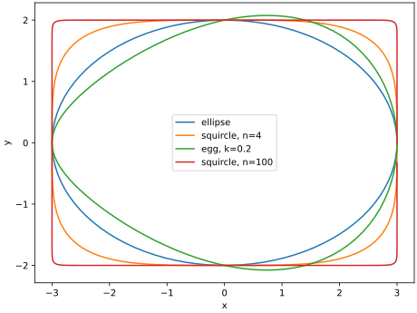

Sometimes it is convenient to be able to parametrically define closed loops with more features than a circle or an ellipse. Here are some additional examples.

## Ellipse

$$\frac{x^2}{a^2}+\frac{y^2}{b^2}=1$$

or:

$$\begin{aligned}
x &= a\cos\theta\\
y &= b\sin\theta
\end{aligned}$$

```python
x = a*np.cos(th)
y = b*np.sin(th)
```

## Oval


$$\begin{aligned}
x &= a\cos\theta\\
y &= b\sin\theta \sqrt{1+kx}
\end{aligned}$$

```python
x = a*np.cos(th)
t = 1 + k*x
y = b*np.sin(th)*np.sqrt(t)
```

## Superellipse

$$\left(\frac{x}{a}\right)^n+\left(\frac{y}{b}\right)^n=1$$

or:

$$\begin{aligned}
x &= a|\cos t|^{\frac{2}{n}}\text{sgn}(\cos t)\\
y &= b|\sin t|^{\frac{2}{n}}\text{sgn}(\sin t)
\end{aligned}$$

```python
x = np.abs(np.cos(th))**(2/n)*a*np.sign(np.cos(th))
y = np.abs(np.sin(th))**(2/n)*b*np.sign(np.sin(th))
```

## Summary

