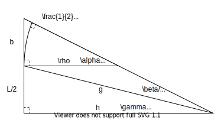
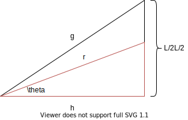
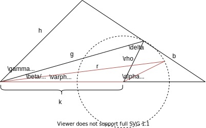
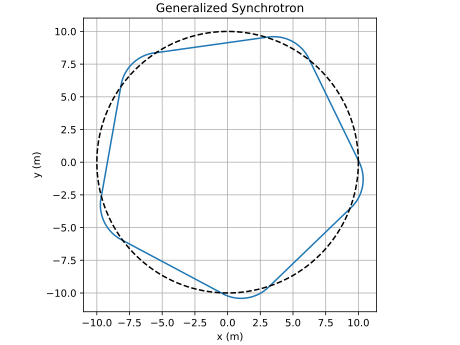

## Synchrotron Geometry

A synchrotron's beam trajectory can be characterized by the perimeter of a rounded polygon with $n$ bends of radius $\rho$ and drifts of length $L$:

Our perimeter $C$ is defined by a characteristic radius $R$:

$$C = 2\pi R = 2\pi \rho + nL$$

The drift length $L$ is therefore:

$$L = 2\pi\frac{(R-\rho)}{n}$$

Our sector unit is defined by angle $\alpha$:

$$\alpha = \frac{2\pi}{n}$$

The rounded corner can be defined by a __right kite__ of sides $\rho$ and $b$:

The interior angle of our n-gon is define by $\pi-\alpha$ so using law of cosines and law of sines respectively:

$$s^2 = 2\rho^2(1-\cos\alpha)$$

$$b = s\frac{\sin\alpha/2}{\sin\alpha}$$

We can then define a minor and major spoke length $h$ and $g$:

$$h = \frac{b+\frac{L}{2}}{\tan\frac{\alpha}{2}}$$

The subsector __drift angle__ is accordingly defined by:

$$\gamma = 2\arctan\left(\frac{L}{2h}\right)$$

And the subsector __bend angle__ is defined by:

$$\beta = \alpha - \gamma$$

Our relative sector coordinate $\psi$ is defined by the absolute polar angle $\phi$ given by:

$$\psi = \mod\left(\phi, \alpha\right)$$

Within the __drift sector__, our relative coordinate $\theta$ is defined by:

$$\theta = \psi-\frac{\gamma}{2}$$

$$\boxed{r(\psi < \gamma) = \frac{h}{\cos\theta}}$$

For the __bend sector__ we define a different offset by:

$$\varphi = \psi - \frac{\beta}{2}-\gamma$$

Where:

$$\delta = \frac{\alpha - \beta}{2}$$

and:

$$k = \rho\frac{\sin\delta}{\sin\beta/2}$$

Therefore from law of cosines:

$$\boxed{r(\psi > \gamma) = k\cos\varphi \pm \sqrt{k^2\cos^2\varphi-k^2+\rho^2}}$$

Then we get:

